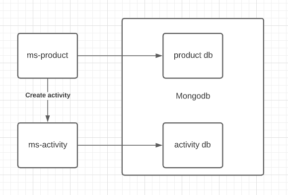
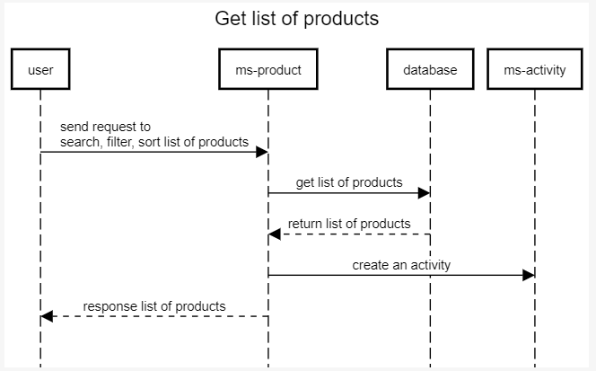
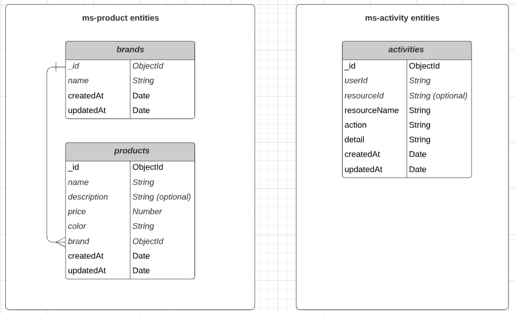

# iCommerce

## High-level solution diagram



- `ms-product` can make http call to `ms-activity` to log user's activity
- Separate database for microservices

## Sequence diagram for get list of products



- If user request to ms-product to get list of products from database successfully, ms-product make an API call to ms-activity to log user's activity
- No need to wait for API call returns a response.
- Using logger to log the error if the API call failed.

## Entity relationship diagram



## Software development principles, patterns & practices being applied

- Single-Responsibility Principle
- Dependency injection
- Repository pattern

## Code folder structure

```
├───apps
│    ├───ms-activity
│    └───ms-product
│        ├───config
│        │    ├───dev.json
│        │    └───production.json
│        ├───doc
│        │    └───definitions.yaml
│        ├───migrations
│        │    └───20210913100816-products.ts
│        ├───src
│        │    ├───activity
│        │    │    ├───__test__
│        │    │    ├───activity.service.spec.ts
│        │    │    ├───activity.service.ts
│        │    │    └───activity.type.ts
│        │    ├───brand
│        │    │    └───__test__
│        │    ├───common
│        │    │    ├───error
│        │    │    └───ioc
│        │    ├───product
│        │    │    ├───product.controller.ts
│        │    │    ├───product.model.ts
│        │    │    ├───product.repository.ts
│        │    │    ├───product.service.ts
│        │    │    ├───product.type.ts
│        │    │    ├───product.util.ts
│        │    │    ├───product.validator.ts
│        │    │    └───__test__
│        │    │        ├───product.controller.spec.ts
│        │    │        └───product.service.spec.ts
│        │    │
│        │    ├───app.ts
│        │    ├───index.ts
│        │    └───__jest__
│        ├───package.json
│        ├───tsconfig.json
│        ├───Dockerfile
│        ├───jest.config
│        └───migrate-mongo-config.js
├───docker-compose.yaml
├───package.json
└───README.md
```

## Libraries / frameworks being used

- ExpressJS
- InversifyJS
- Mongoose as ORM
- axios: make http requests
- migrate-mongo: migrate database
- swagger-ui-express, swagger-jsdoc: documenting APIs
- Winston: logger
- Joi: validate request
- Jest: run unit test
- Husky & lint-staged: add pre-commit hook to reformat and lint staged files.
- Husky: add pre-push hook to check unit test coverage.
- eslint, prettier: check code standard.
- config: read from pre-set configuration file.

## Launch services for integration testing (using docker-compose)

- Clone this repo https://github.com/vuna91/iCommerce.git
- Run `docker-compose up` at the same directory as `docker-compose.yaml`

#### Swagger for API documentation

- ms-product: http://localhost:3000/api-docs
- ms-activity: http://localhost:3001/api-docs

#### CURL commands to verify the APIs

- Search, filter, sort list of products
  ```
  curl -X 'GET' \
   'http://localhost:3000/products?name=samsung&color=black&brand=613f2434a4106ab54c662860&sortBy=price:asc' \
   -H 'accept: application/json'
  ```
- Create a new product
  ```
  curl -X 'POST' \
    'http://localhost:3000/products' \
    -H 'accept: application/json' \
    -H 'Content-Type: application/json' \
    -d '{
    "name": "new Apple iPhone 13 Pro Max 128GB",
    "price": 36123000,
    "color": "black",
    "brand": "613f242d82d0479055e95dcc"
  }'
  ```
- Get product's details
  ```
  curl -X 'GET' \
    'http://localhost:3000/products/6140bbef7c221be784e8fc2a' \
    -H 'accept: application/json'
  ```
- Get all activities
  ```
  curl -X 'GET' \
    'http://localhost:3001/activities' \
    -H 'accept: application/json'
  ```

## Run unit test

- Run unit test for ms-product
  - `cd` to **apps/ms-product**
  - Run `yarn install`
  - Run `yarn test` or `yarn test:cov` with coverage
- Run unit test for ms-activity
  - `cd` to **apps/ms-activity**
  - Run `yarn install`
  - Run `yarn test` or `yarn test:cov` with coverage
